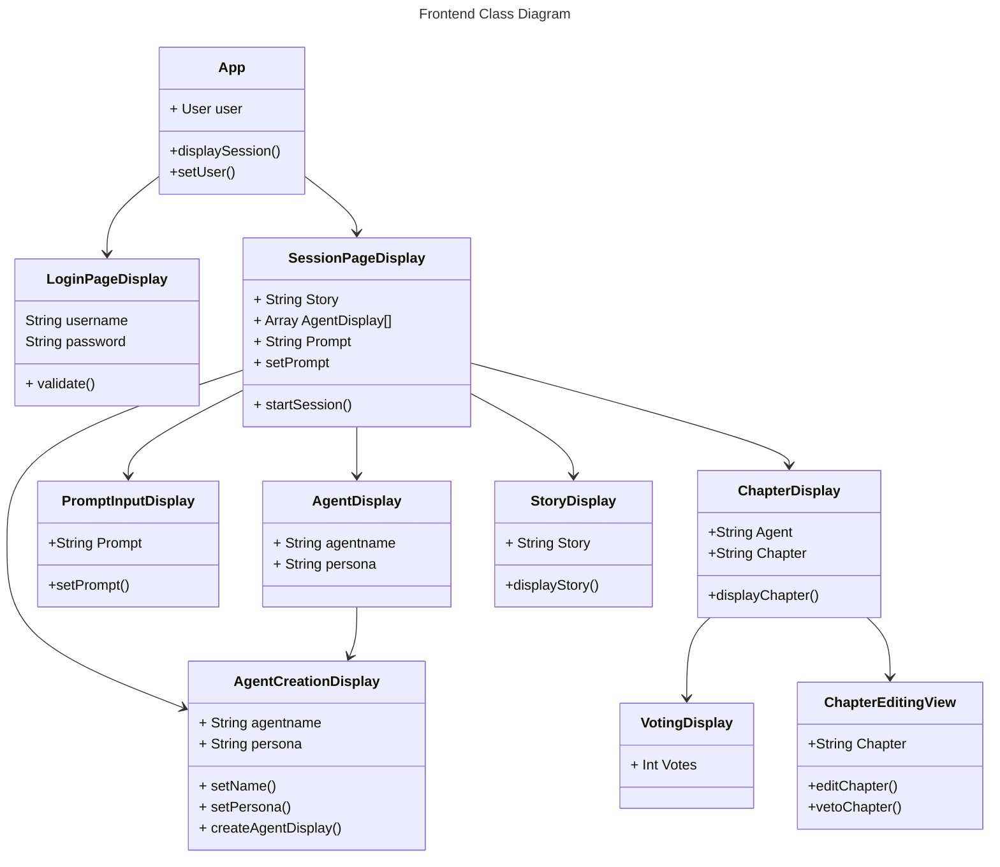
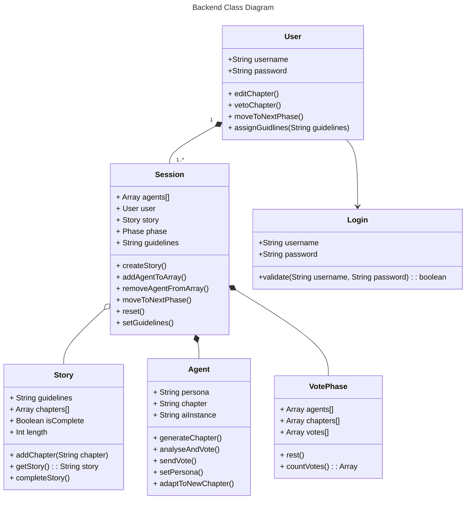

### Components

Provided below are descriptions of the different components and their interfaces.

#### Client/Frontend

This is a React-based web application that will require the use of a login page, a homeboard page, and a couple other accompanying pages (determined by the features added). The client will be connected to the server via a WebSocket connection that will allow for communication between the two components.

#### Backend

The backend is built using JavaScript, with Node.js and Express. It handles data sent from the other components and processes it. 

**Figure 1.1** blah blah blah description

# Agent Class 
## Data Fields: 
    - 'String persona' : Stores speficifed infornation about the agents character like an author to imitate
    - 'String chapter' : Stores most recently generated chapter 
    - 'String aiInstance' : Stores connection to AI 

## Methods: 
    - `generateChapter()`
        Purpose: Generates a chapter by the agent 
        Pre-conditions: The agent must be generated, a prompt must be avalible to utilize. 
        Post-conditions: Creates a chapter based on condtions give. 
        Parameters: prompt, context 
        Return value: string chapter

    - `analyseAndVote()` 
        Purpose: Agent will judge other chapters based on our critera and cast a vote based on judgement 
        Pre-conditions: The agent must be generated, chapters from all agents must be generated 
        Post-conditions: Choose Vote
        Parameters: None
        Return value: String AgentVotedFor 

    - `sendVote()`
        Purpose: Will send the vote to be tallied 
        Pre-conditions: The agent has run analyzeAndVote() and returned a value 
        Post-conditions: Cast a vote 
        Parameters: String vote
        Return value: Boolean 

    - `setPersona()`
        Purpose: Set persona
        Pre-conditions: The agent is created the stpry creation has not started 
        Parameters: String persona 
        Return value: Boolean 

        

#### Database

Firebase is used to store all of the necessary information generated and needed by the system to create the storyboard and drive user interaction. The database will contain information about chapters in the story, user data, and the generated critiques, goals, and votes.

#### LLM

The OpenAI API is used to generate content. It is connected to the Agents who request data for transmission and generation.